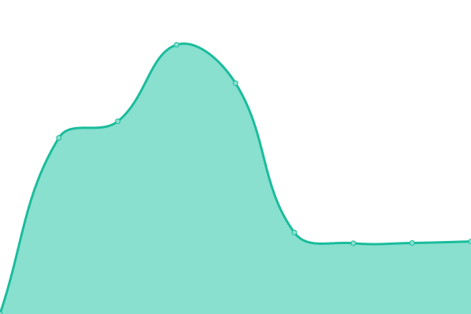

# [📈 Live Status](https://baronhez.github.io/upptime): <!--live status--> **🟩 All systems operational**

This repository contains the open-source uptime monitor and status page for [Jonathan Ródenas López](https://jonthan.xyz/), powered by [Upptime](https://github.com/upptime/upptime).

With [Upptime](https://upptime.js.org), you can get your own unlimited and free uptime monitor and status page, powered entirely by a GitHub repository. We use [Issues](https://github.com/baronhez/upptime/issues) as incident reports, [Actions](https://github.com/baronhez/upptime/actions) as uptime monitors, and [Pages](https://baronhez.github.io/upptime) for the status page.

<!--start: status pages-->
<!-- This summary is generated by Upptime (https://github.com/upptime/upptime) -->
<!-- Do not edit this manually, your changes will be overwritten -->
<!-- prettier-ignore -->
| URL | Status | History | Response Time | Uptime |
| --- | ------ | ------- | ------------- | ------ |
|  [WebPage CV](https://jonthan.xyz) | 🟩 Up | [web-page-cv.yml](https://github.com/Baronhez/Uptimer/commits/HEAD/history/web-page-cv.yml) | 

 6068ms
     
 | 

<a href="https://Baronhez.github.io/Uptimer/history/web-page-cv">99.41%</a>
    

|  [Server Dashboard](https://server.jonthan.xyz) | 🟩 Up | [server-dashboard.yml](https://github.com/Baronhez/Uptimer/commits/HEAD/history/server-dashboard.yml) | 

 4151ms
     
 | 

<a href="https://Baronhez.github.io/Uptimer/history/server-dashboard">99.42%</a>
    

|  [Speedtest on my server](https://speedtest.jonthan.xyz) | 🟩 Up | [speedtest-on-my-server.yml](https://github.com/Baronhez/Uptimer/commits/HEAD/history/speedtest-on-my-server.yml) | 

 5994ms
     
 | 

<a href="https://Baronhez.github.io/Uptimer/history/speedtest-on-my-server">99.42%</a>
    

<!--end: status pages-->

[**Visit our status website →**](https://baronhez.github.io/Uptimer)

## 📄 License

- Powered by: [Upptime](https://github.com/upptime/upptime)
- Code: [MIT](./LICENSE) © [Jonathan Ródenas López](https://jonthan.xyz/)
- Data in the `./history` directory: [Open Database License](https://opendatacommons.org/licenses/odbl/1-0/)
